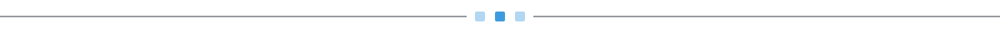
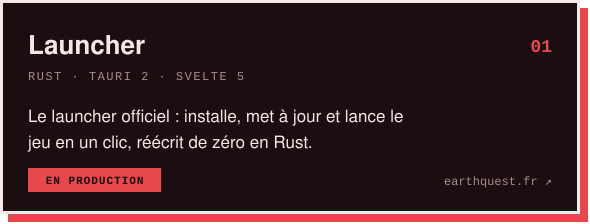
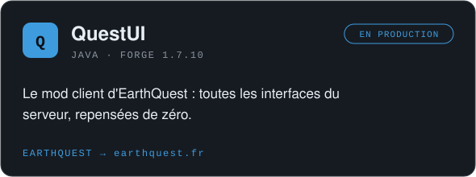
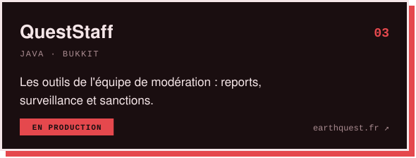
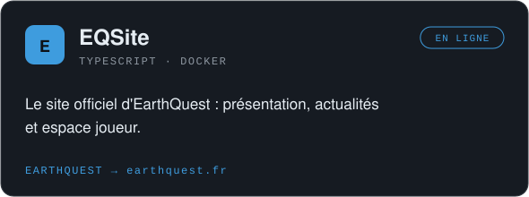
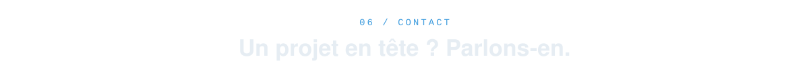
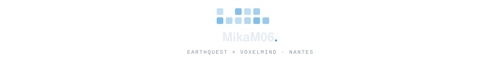

<!--
  Profil de MikaM06 — un seul accent : le bleu EarthQuest.
  assets/*       → node scripts/build-assets.mjs
  serpent        → .github/workflows/snake.yml (branche output, chaque nuit)
-->

<picture>
  <source media="(prefers-color-scheme: light)" srcset="./assets/hero-light.svg"/>
  
</picture>

  <a href="#projets"><picture><source media="(prefers-color-scheme: light)" srcset="./assets/btn-projects-light.svg"/></picture></a>
  &nbsp;
  <a href="#contact"><picture><source media="(prefers-color-scheme: light)" srcset="./assets/btn-contact-light.svg"/></picture></a>

<picture><source media="(prefers-color-scheme: light)" srcset="./assets/divider-light.svg"/></picture>

<!-- ─────────────────────────────────────────────────────────── à propos -->

<picture>
  <source media="(prefers-color-scheme: light)" srcset="./assets/section-about-light.svg"/>
  
</picture>

Salut, moi c'est <b>Louhan</b> 👋 
Je développe autour de <b>Minecraft</b> depuis plusieurs années : plugins Bukkit/Spigot, mods Forge, 
outils serveur et launchers. Aujourd'hui, j'y ajoute <b>Rust</b> et le web pour construire des outils complets.

J'ai fondé <a href="https://www.earthquest.fr"><b>EarthQuest</b></a>, un serveur Minecraft moddé porté par <b>VoxelMind</b>, 
et je suis en première année à <b>Epitech Nantes</b>.

  <code>BASE</code>&nbsp; Nantes, France &nbsp;&nbsp;&nbsp; <code>ÉQUIPE</code>&nbsp; <a href="https://github.com/EarthQuestMc">@EarthQuestMc</a> &nbsp;&nbsp;&nbsp; <code>ÉCOLE</code>&nbsp; Epitech · Tek1

<picture><source media="(prefers-color-scheme: light)" srcset="./assets/divider-light.svg"/></picture>

<!-- ─────────────────────────────────────────────────────────── earthquest -->

<picture>
  <source media="(prefers-color-scheme: light)" srcset="./assets/section-earthquest-light.svg"/>
  
</picture>

  <a href="https://www.earthquest.fr"><picture><source media="(prefers-color-scheme: light)" srcset="./assets/projects/launcher-light.svg"/></picture></a>
  <a href="https://www.earthquest.fr"><picture><source media="(prefers-color-scheme: light)" srcset="./assets/projects/questui-light.svg"/></picture></a>

  <a href="https://www.earthquest.fr"><picture><source media="(prefers-color-scheme: light)" srcset="./assets/projects/queststaff-light.svg"/></picture></a>
  <a href="https://www.earthquest.fr"><picture><source media="(prefers-color-scheme: light)" srcset="./assets/projects/eqsite-light.svg"/></picture></a>

<!-- ─────────────────────────────────────────────────────────── projets perso -->

<picture>
  <source media="(prefers-color-scheme: light)" srcset="./assets/section-projects-light.svg"/>
  
</picture>

  <a href="https://github.com/MikaM06/Voxora"><picture><source media="(prefers-color-scheme: light)" srcset="./assets/projects/voxora-light.svg"/></picture></a>
  <a href="https://github.com/MikaM06/TeamSpeak6SoundBoard"><picture><source media="(prefers-color-scheme: light)" srcset="./assets/projects/soundboard-light.svg"/></picture></a>

  <a href="https://github.com/MikaM06/HubPlugin"><picture><source media="(prefers-color-scheme: light)" srcset="./assets/projects/hubplugin-light.svg"/></picture></a>
  <a href="https://github.com/MikaM06/NoPhantom"><picture><source media="(prefers-color-scheme: light)" srcset="./assets/projects/nophantom-light.svg"/></picture></a>

<b>Et aussi</b>

 

- **[UnderBot](https://github.com/MikaM06/UnderBot)** : un bot Discord en JavaScript.
- **[UnderTools](https://github.com/MikaM06/UnderTools)** : un mod d'armures, d'épées et d'outils.
- **[UnderStaff](https://github.com/MikaM06/UnderStaff)**, **[UnderSpy](https://github.com/MikaM06/UnderSpy)**, **[UnderChatStaff](https://github.com/MikaM06/UnderChatStaff)** : mes premiers outils de modération.
- **[JoinWebhook](https://github.com/MikaM06/JoinWebhook)**, **[AutoOP](https://github.com/MikaM06/AutoOP)**, **[ModIDGrabber](https://github.com/MikaM06/ModIDGrabber)** : de petits plugins utilitaires.

<picture><source media="(prefers-color-scheme: light)" srcset="./assets/divider-light.svg"/></picture>

<!-- ─────────────────────────────────────────────────────────── stack -->

<picture>
  <source media="(prefers-color-scheme: light)" srcset="./assets/section-stack-light.svg"/>
  
</picture>

<picture>
  <source media="(prefers-color-scheme: light)" srcset="./assets/stack-light.svg"/>
  
</picture>

<picture><source media="(prefers-color-scheme: light)" srcset="./assets/divider-light.svg"/></picture>

<!-- ─────────────────────────────────────────────────────────── activité -->

<picture>
  <source media="(prefers-color-scheme: light)" srcset="./assets/section-activity-light.svg"/>
  
</picture>

<picture>
  <source media="(prefers-color-scheme: light)" srcset="https://streak-stats.demolab.com?user=MikaM06&hide_border=true&background=F6F8FA&ring=1C7ED6&fire=1C7ED6&currStreakLabel=1C7ED6&sideLabels=1F2328&dates=59636E&currStreakNum=1F2328&sideNums=1F2328&stroke=D0D7DE&locale=fr"/>
  
</picture>

<picture>
  <source media="(prefers-color-scheme: light)" srcset="https://raw.githubusercontent.com/MikaM06/MikaM06/output/snake-light.svg"/>
  
</picture>

<picture><source media="(prefers-color-scheme: light)" srcset="./assets/divider-light.svg"/></picture>

<!-- ─────────────────────────────────────────────────────────── contact -->

<picture>
  <source media="(prefers-color-scheme: light)" srcset="./assets/section-contact-light.svg"/>
  
</picture>

  <a href="https://www.earthquest.fr"><picture><source media="(prefers-color-scheme: light)" srcset="./assets/btn-website-light.svg"/></picture></a>
  &nbsp;
  <a href="https://github.com/MikaM06"><picture><source media="(prefers-color-scheme: light)" srcset="./assets/btn-github-light.svg"/></picture></a>

 

<picture>
  <source media="(prefers-color-scheme: light)" srcset="./assets/footer-light.svg"/>
  
</picture>

