<!--
  assets/*  → node scripts/build-assets.mjs
  serpent   → .github/workflows/snake.yml (branche output)
-->

<picture>
  <source media="(prefers-color-scheme: light)" srcset="./assets/hero-light.svg"/>
  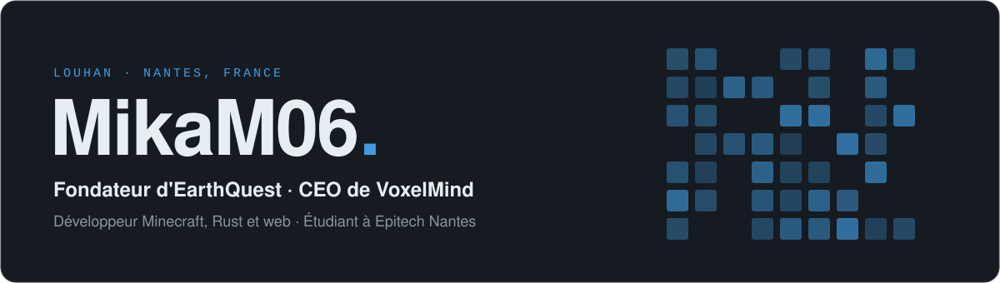
</picture>

<picture>
  <source media="(prefers-color-scheme: light)" srcset="./assets/section-about-light.svg"/>
  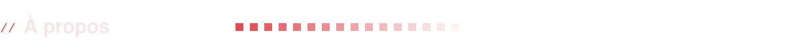
</picture>

Salut, moi c'est Louhan 👋

Je code autour de Minecraft depuis des années : des plugins, des mods, des outils pour faire tourner des serveurs. C'est de là qu'est né [EarthQuest](https://www.earthquest.fr), un serveur moddé en 1.7.10 que je développe aujourd'hui avec VoxelMind.

À côté, je suis étudiant en première année à Epitech Nantes.

<code>BASE</code>&nbsp; Nantes &nbsp;&nbsp;&nbsp; <code>ÉQUIPE</code>&nbsp; <a href="https://github.com/EarthQuestMc">@EarthQuestMc</a> &nbsp;&nbsp;&nbsp; <code>ÉCOLE</code>&nbsp; Epitech · Tek1

<picture>
  <source media="(prefers-color-scheme: light)" srcset="./assets/section-earthquest-light.svg"/>
  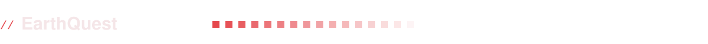
</picture>

<a href="https://www.earthquest.fr"><picture>
  <source media="(prefers-color-scheme: light)" srcset="./assets/earthquest-light.svg"/>
  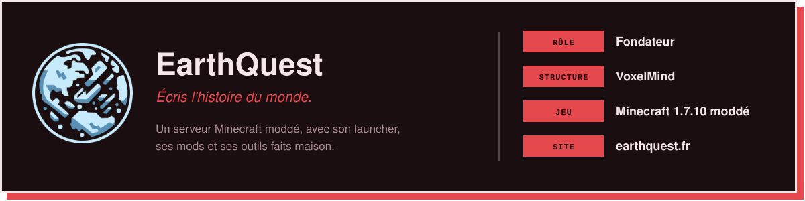
</picture></a>

<picture>
  <source media="(prefers-color-scheme: light)" srcset="./assets/section-projects-light.svg"/>
  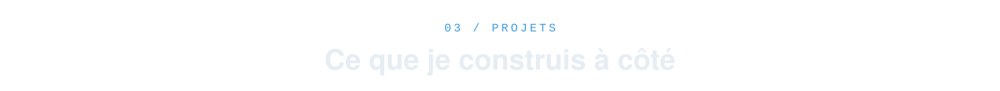
</picture>

  <a href="https://github.com/MikaM06/Voxora"><picture><source media="(prefers-color-scheme: light)" srcset="./assets/projects/voxora-light.svg"/>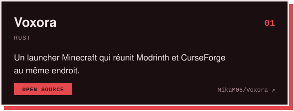</picture></a>
  <a href="https://github.com/MikaM06/TeamSpeak6SoundBoard"><picture><source media="(prefers-color-scheme: light)" srcset="./assets/projects/soundboard-light.svg"/>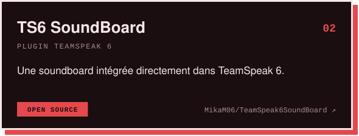</picture></a>

  <a href="https://github.com/MikaM06/HubPlugin"><picture><source media="(prefers-color-scheme: light)" srcset="./assets/projects/hubplugin-light.svg"/>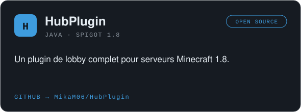</picture></a>
  <a href="https://github.com/MikaM06/NoPhantom"><picture><source media="(prefers-color-scheme: light)" srcset="./assets/projects/nophantom-light.svg"/>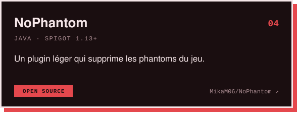</picture></a>

<b>Plus anciens</b>

 

- [UnderBot](https://github.com/MikaM06/UnderBot), un bot Discord
- [UnderTools](https://github.com/MikaM06/UnderTools), un mod d'armures et d'outils
- [UnderStaff](https://github.com/MikaM06/UnderStaff), [UnderSpy](https://github.com/MikaM06/UnderSpy) et [UnderChatStaff](https://github.com/MikaM06/UnderChatStaff), mes premiers outils de modération
- [JoinWebhook](https://github.com/MikaM06/JoinWebhook), [AutoOP](https://github.com/MikaM06/AutoOP) et [ModIDGrabber](https://github.com/MikaM06/ModIDGrabber), de petits plugins

<picture>
  <source media="(prefers-color-scheme: light)" srcset="./assets/section-stack-light.svg"/>
  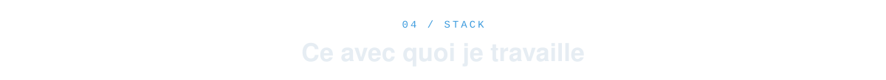
</picture>

<picture>
  <source media="(prefers-color-scheme: light)" srcset="./assets/stack-light.svg"/>
  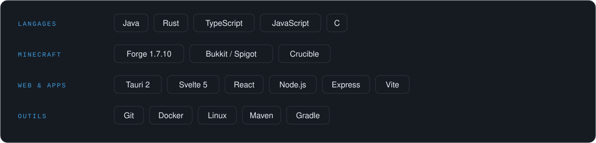
</picture>

<picture>
  <source media="(prefers-color-scheme: light)" srcset="./assets/section-activity-light.svg"/>
  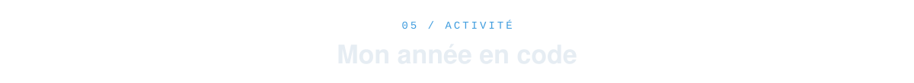
</picture>

<picture>
  <source media="(prefers-color-scheme: light)" srcset="https://raw.githubusercontent.com/MikaM06/MikaM06/output/snake-light.svg"/>
  
</picture>

<a href="https://www.earthquest.fr">earthquest.fr</a>

